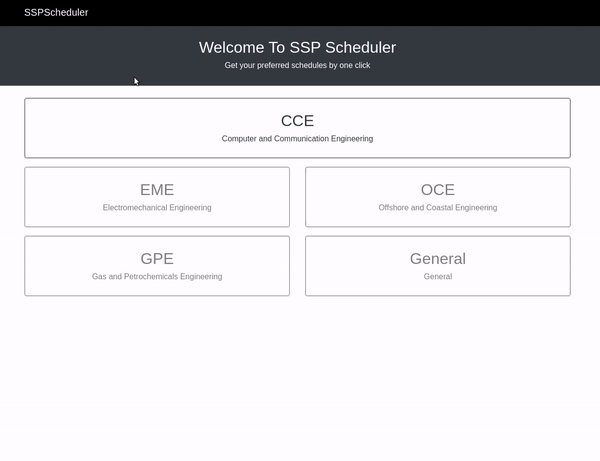

# SSP-Scheduler
SSP-Scheduler is a website help in creating the desired schedules with all wanted preferences in no time. 
[SSP-Scheduler](http://google.com)

## Table of Contents
* [Motivation](#motivation)
* [Appearance](#appearance)
* [Built with](#built-with)
* [Features](#features)
* [Sub-projects](#sub-projects)

## Motivation
By developing this application we solved a big problem for us.
The problem was spending a lot of time at the beginning of each semester in creating our schedules with our preferences like a shrinking the gaps between learning slots during the day, choosing specific instructors and many others.
So main motives that derived us to develop this application:
* Solving our problem with our software knowledge to make our lives easier which is the purpose of software came out.
* Help our collegues that facing the same problem too.
* Level up our problem-solving, coding and software development skills and push them further.

## Appearance

## Built with
[Django](https://www.djangoproject.com) 
[Bootstarp](https://getbootstrap.com)

## Features
* Priorities of instructors from avoid this instructor to give this instructor highest priority.
* Schedule density minimum or maximum days during the week.
* Prefered days off that scheduler will try to keep them empty.
* Alternative schedule for each course in the best schedule to provide backup schedules in case of not able to register the best schedule
* Register different courses from different terms in the same department

## Sub-projects
[Database-Filler](https://github.com/ahmedfawzy98/Database-filler)

